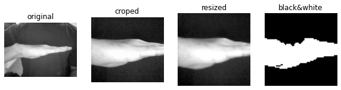
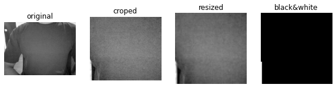

# Webcam Game Controller

This is a simple system that uses a webcam and a *very small* neural network to control a game in realtime. No pre-trained models or any other data is used. 

*All is done from scratch* and the end model *has just ~800 weights or ~7KB!* ⚡️


This project was developed as a part of a challenge. The final [project report](notebooks/project_report.ipynb) summarizes the full process of developing the system.

But here's a quick overview. 😊

## Table of Contents
- [Running The System](#running-the-system)
- [System Overview In A Nutshell](#system-overview-in-a-nutshell)
  * [main.py](#mainpy)
  * [Inside run_system](#inside-run_system)
- [Data Processing](#data-processing)
- [Model](#model)
- [Data Collection](#data-collection)
- [Training](#training)

## Running The System
I would strongly recommend using the amazing [uv](https://astral.sh/blog/uv) python package manager to install the dependencies, its a drop-in replacement for pip and venv from the creators of [ruff](https://astral.sh/ruff).

Your mind will be blown by how fast it is. 🔥

```bash
curl -LsSf https://astral.sh/uv/install.sh | sh
uv venv venv
source venv/bin/activate
uv pip compile requirements.in -o requirements.txt
uv pip install -r requirements.txt
python main.py
```

If you don't want to use uv, you can just use pip and venv as usual.
```bash
python -m venv venv
source venv/bin/activate
pip install pip-tools
pip-compile requirements.in -o requirements.txt
pip install -r requirements.txt
python main.py
```

## System Overview In A Nutshell

### main.py
Load the model's weights: 
```python
model = CNNv2()
model.load_state_dict(
    torch.load(os.path.join(env.models_path, 'cnnv2_3.pt'))
)
```
and run the game loop.
```python
run_system(model=model)
```

### Inside run_system

Define the mappings between the neural network's output and the game's controls. 
```python
action_mappings = {'left': 0, 'right': 2, 'wait': 1}
```
Setup the game environemnt to the initial state, create the VideoCapture object to capture the webcam's feed (device 0), and set the font for the text that will be displayed on the screen. 
```python
env = gym.make('MountainCar-v0', render_mode='human')
env.reset()
cap = cv2.VideoCapture(0)
font = cv2.FONT_HERSHEY_SIMPLEX
```


Set the neural network to evaluation mode so that it doesn't update its weights or keep track of gradients. 
```python
model.eval()
```
While the user hasn't quit the game.
```python
while True and cap.isOpened():
```
Capture the webcam's feed, process it, and get the neural network's output.  
```python
ret, frame = cap.read()
im = np.array(frame)
im_processed, prediction = model_predict(model, im, raw=True)
```
Then, resize the processed image and render it to the screen, also render the original image with the model's prediction overlayed.
```python
im_processed = cv2.resize(im_processed, (im.shape[1], im.shape[0]))
cv2.putText(im, prediction, (250, 250), font, 1, (0, 255, 0), 3)
cv2.imshow('original', im)
cv2.imshow('processed', im_processed)
```
Get the action from the neural network's output and apply it to the game environment. If the new state is the goal state, reset the environment.

```python
action = action_mappings[prediction]
state = env.step(action)[0]
position = state[0]
done = position >= 0.5
if done:
    env.reset()
env.render()
```

Wait for 10ms and check if the user has pressed a key, map the key value to the last 8 bits (`& 0xFF`) to get the ascii value and check if it's the `q` key, if it is, release the resources, break the loop and close the game. 
```python
if cv2.waitKey(10) & 0xFF == ord('q'):
    cap.release()
    cv2.destroyAllWindows()
    break
```

That's all there is to the game & inference loop.

## Data Processing

All the tricks are meant to decrease the complexity of the input as much as possible so we can make the neural network's job easier and thereby get away with our humble 800 weights.

As we saw, the processing happens in the `model_predict` function. Let's take a look at it.

We first check the raw flag which is used to determine if the input image is already processed or not. If it's not, we convert the image to grayscale and apply some preprocessing to it. 

We go from a 3 channel image to a 1 channel image.
```python
def model_predict(model, im, raw=False):
    if raw:
        im = cv2.cvtColor(im, cv2.COLOR_BGR2GRAY)
        im = preprocessing.process_image(im, )
```

what processing is applied to the image? Well, we just CROP it, RESIZE it, and BLACK & WHITE it. 

```python
def process_image(im):
    return black_white(resize(crop(im)))
```

The `crop` is meant to remove as many unneeded pixels as possible, just keep the central ~30% of it which is where we are going to do our hand gestures to control the game.

```python
def crop(im, w_crop=.25, h_crop=.2):
    h, w = im.shape
    h_margin, w_margin = int(h*h_crop), int(w*w_crop)
    return im[h_margin:-h_margin, w_margin:-w_margin]
```

The `resize` step maps the croped image to just 64x64 pixels, a huge reduction in inputsize. (Curious about the [interpolation method](https://medium.com/@wenrudong/what-is-opencvs-inter-area-actually-doing-282a626a09b3)? )

```python
def resize(im, shape=(64, 64)):
    width = int(im.shape[1] * shape[1]/ im.shape[1])
    height = int(im.shape[0] * shape[0]/ im.shape[0])
    return cv2.resize(im, (width, height), interpolation=cv2.INTER_AREA)
```

Finally, the `black_white` step is just a thresholding operation. If the pixel value is greater than the average of neighborhood (`63x63`) minus a constant (`-30`) then it's set to 255, otherwise it's set to 0. That's what binary thresholding does. Considering neighborhood average instead of a global one is what makes it "adaptive".  

```python
def black_white(im):
    return cv2.adaptiveThreshold(im, 255, cv2.ADAPTIVE_THRESH_GAUSSIAN_C, cv2.THRESH_BINARY, 63, -30)
```

Note this is also a huge reduction in input complexity. Each pixel can have 2 values instead of 256. So the space of possible inputs is just `2^64x64` instead of `256^64x64`.


With the input size reduced to black & white 64x64 images, we can afford a small neural network. But how small?

The complexity of the input also a function of the specific shapes the network should recognize. So we can keep simplifying the task. Our game only has 3 possible actions, so we can pick 3 easily distinguishable shapes. What about just vertical edges, horizontal edges, and *nothing*?

### Vertical egdes


### Horizontal edges



### Nothing



## Model

Now that we have a very simple input, we can afford a very simple model. 

A convolutional neural network with 3 layers, with 3, 4, and 4 kernels, respectively. The kernel size is 3 and the stride is 2 (squeshing the input size to the last linear layer by a factor of 2). 

A single batch normalization layer is used after the first convolutional layer.

And we use relu as the activation function.

This adds up to just 887 parameters to be learned, which weights just 7KB.

```python
# models/models.py
class CNNv2(nn.Module):
    def __init__(self, input_height=64, input_width=64, outputs=3, n_kernels=(3, 4, 4), kernel_size=3, stride=2):
        super().__init__()
        self.conv1 = nn.Conv2d(1, n_kernels[0], kernel_size=kernel_size, stride=stride)
        self.bn = nn.BatchNorm2d(n_kernels[0])
        self.conv2 = nn.Conv2d(n_kernels[0], n_kernels[1], kernel_size=kernel_size, stride=stride)
        self.conv3 = nn.Conv2d(n_kernels[1], n_kernels[2], kernel_size=kernel_size, stride=stride)

        # compute output of convolutional layers
        def conv2d_size_out(size, kernel_size=kernel_size, stride=stride):
            return (size - (kernel_size - 1) - 1) // stride + 1

        conv_width = conv2d_size_out(conv2d_size_out(conv2d_size_out(input_width)))
        conv_height = conv2d_size_out(conv2d_size_out(conv2d_size_out(input_height)))
        linear_input_size = conv_width * conv_height * n_kernels[-1]
        self.head = nn.Linear(linear_input_size, outputs)

    # Called with either one element to determine next action, or a batch during optimization
    def forward(self, x):
        x = F.relu(self.bn(self.conv1(x)))
        x = F.relu(self.conv2(x))
        x = F.relu(self.conv3(x))
        return self.head(x.view(x.size(0), -1))
```

## Data Collection


A video for each gesture is recorded, then labeling is just a matter of extracting the frames and placing them in a folder with the label's name.

Notice how this approach bypasses the naive method of manually going through each frame and labeling it.

Once we have the images creating a dataset requires just processing them:
```python
# utils/preprocessing.py
def process_frames(src_folder, dst_folder):
    prefix = os.path.split(src_folder)[1]
    for i, filename in enumerate(os.listdir(src_folder)):
        im_path = os.path.join(src_folder, filename)
        im = cv2.imread(im_path, cv2.IMREAD_GRAYSCALE)
        im_processed = process_image(im)
        new_filename = f"{prefix}_{i}.jpg"
        cv2.imwrite(os.path.join(dst_folder, new_filename), im_processed)
...
# scripts/preprocess_frames.py
for src_folder, dst_folder in tqdm(zip(src_folders, dst_folders)):
    preprocessing.process_frames(src_folder, dst_folder)
```
Loading them:
```python
# utils/create_dataset.py
def load_images(processed_imgs_path):
    folders = ["left", "right", "wait"]
    n_files = sum([len(os.listdir(os.path.join(processed_imgs_path, folder))) for folder in folders])
    x = np.zeros((n_files, 64, 64, 1))
    y = np.zeros(n_files)
    file_idx = 0
    for label, folder in enumerate(folders):
        folder_path = os.path.join(processed_imgs_path, folder)
        for file in os.listdir(folder_path):
            filename = os.path.join(folder_path, file)
            x_tmp = cv2.imread(filename, cv2.IMREAD_GRAYSCALE)
            x_tmp = np.expand_dims(x_tmp, axis=2)
            x[file_idx, :, :] = x_tmp
            y[file_idx] = label
            file_idx += 1
    return x, y
```

And spliting them into train and test sets:
```python
# utils/create_dataset.py
def create_dataset(processed_imgs_path, train_split=0.8):
    x, y = load_images(processed_imgs_path=processed_imgs_path)
    n_train_samples = math.floor(len(x) * train_split)
    indexes = np.array(range(len(x)))
    np.random.shuffle(indexes)

    train_idx = indexes[:n_train_samples]
    test_idx = indexes[n_train_samples:]

    x_train = x[train_idx, :, :]
    y_train = y[train_idx]

    x_test = x[test_idx, :, :]
    y_test = y[test_idx]

    assert len(x_test)+len(x_train) == len(x)
    return x_train, y_train, x_test, y_test
```

## Training
The training code can be found in the [train.py](scripts/train.py) file. It contains the logic for the different experiments that were run to find the best model. In a nutshell it boils down to:

```python
def train_model(model, criterion, optimizer, trainloader, epochs, verbose=False):
    for epoch in range(epochs):
        running_loss = 0.0
        for i, (inputs, labels) in enumerate(trainloader):
            # zero the parameter gradients
            optimizer.zero_grad()
            # forward + backward + optimize
            outputs = model(inputs)
            loss = criterion(outputs, labels)
            loss.backward()
            optimizer.step()
            running_loss += loss.item()
        if epoch % 2 == 0 and verbose:
            print(f'epoch = {epoch} | loss: {running_loss / i}')
```
Where the `model` is the neural network, `criterion` is the loss function, `optimizer` is the optimization algorithm, `trainloader` is just a wrapper around the dataset that allows us to iterate over it efficiently, and `epochs` is the number of times the model will see the whole dataset.
